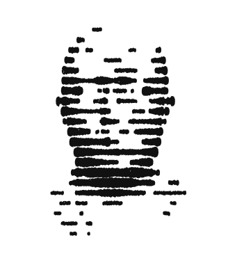

<picture>
  <source media="(prefers-color-scheme: dark)" srcset="portrait-dark.gif">
  
</picture>

### Nakul Rejeesh

Computer Engineering @ UNSW

webapps / embedded / arduino / esp32 / fpga

python · c · swift · javascript · lua · assembly · typescript

[portfolio](https://github.com/n4kulr/portfolio) · [linkedin](https://www.linkedin.com/in/nakul-rejeesh-a5498736b/) · [email](mailto:nakulrejeesh2005@gmail.com)

 
